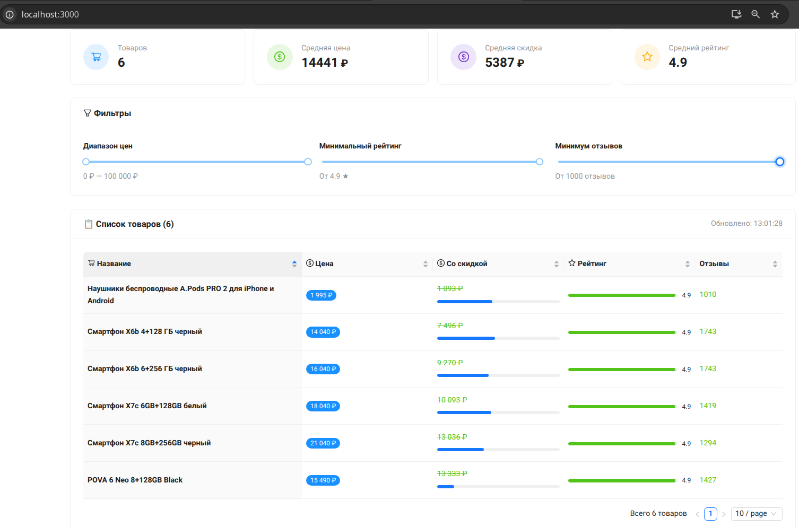
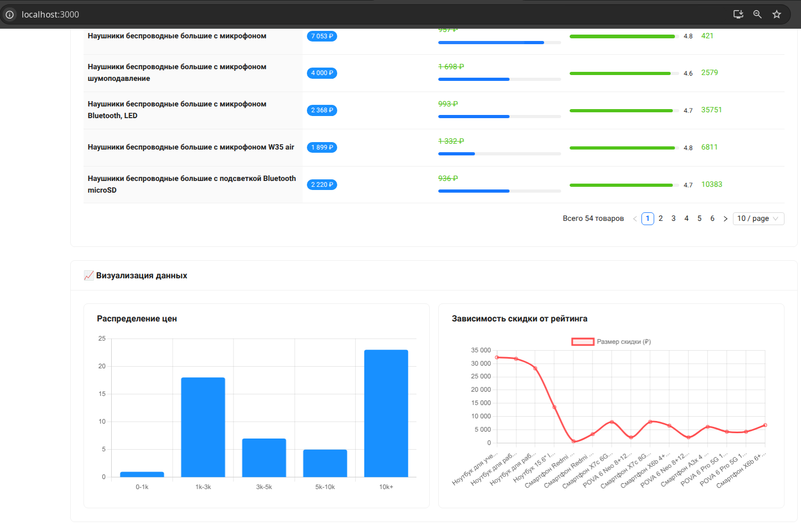
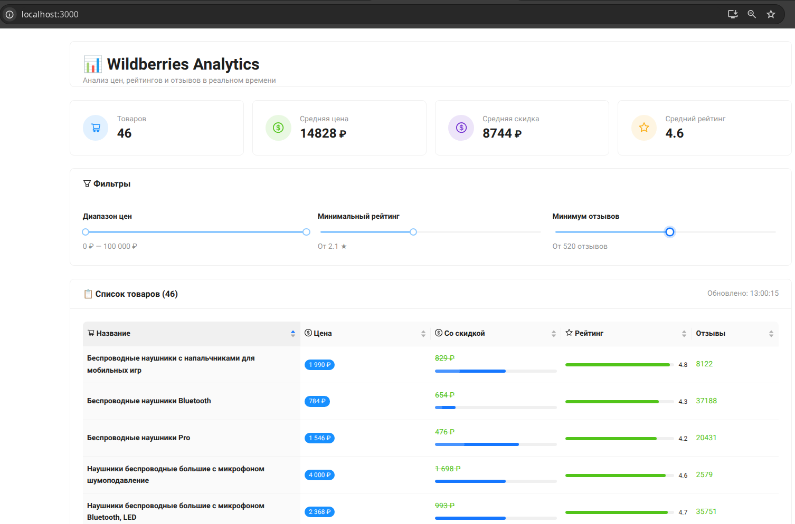

# Wildberries Analytics

Аналитическое приложение для товаров Wildberries с визуализацией данных.





## Технологии

- **Backend**: Python (FastAPI, SQLAlchemy)
- **Frontend**: React, Ant Design
- **Парсер**: BeautifulSoup, Requests
- **БД**: SQLite

## Требования
- Python 3.8+
- Node.js 14+
- npm 6+

## Установка и запуск

### 1. Клонирование репозитория
```bash
git clone https://github.com/Marutyan96/wildberries-analytics.git
cd wildberries-analytics

2. Запуск бэкенда
cd backend

# Создание виртуального окружения (Linux/macOS)
python3 -m venv venv
source venv/bin/activate

# Для Windows:
python -m venv venv
venv\Scripts\activate

# Установка зависимостей
pip install -r requirements.txt

# Инициализация БД
python3 -m app.init_db

# Запуск парсера (опционально)
python3 -m app.parser

# Запуск сервера
python3 -m app.main

3. Запуск фронтенда

Откройте новый терминал:

cd ../frontend

# Установка зависимостей
npm install

# Запуск приложения
npm start

Сервер будет доступен по адресу: http://localhost:8000
Приложение будет доступно по адресу: http://localhost:3000

